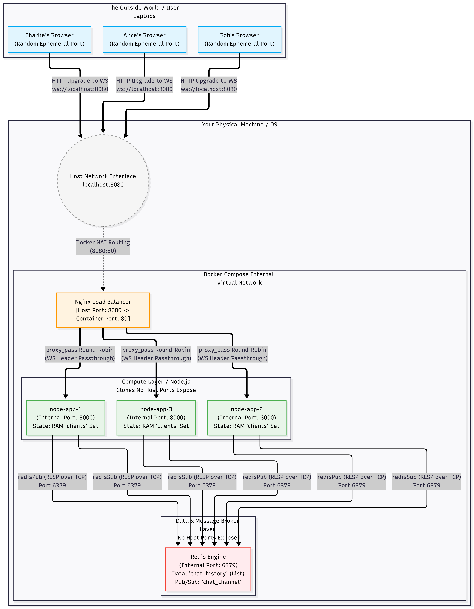

# Distributed Pub/Sub Chat Node

This repository contains a lightweight, horizontally scalable real-time chat server. It is built using Node.js, WebSockets, and Redis.

The primary objective of this project is to demonstrate core system design principles, specifically how to transition a stateful monolithic application into a stateless, distributed system. By decoupling the compute layer (Node.js) from the data layer (Redis), the architecture supports running multiple server instances concurrently without losing data or isolating users.

## Architecture Overview

The system is broken down into four main components:

1. **The Client (Frontend)**
A simple HTML and vanilla JavaScript interface that utilizes the browser's native WebSocket API. It maintains a persistent two-way connection with the backend to send and receive messages in real time without polling.
2. **The Load Balancer (Nginx)**
Acts as a reverse proxy and traffic cop at the entry point of the network. It intercepts incoming HTTP and WebSocket requests and uses a Round-Robin algorithm to distribute the connections evenly across the available Node.js server clones.
3. **The Compute Layer (Node.js Servers)**
The backend uses Node.js native modules to serve the static frontend, and the `ws` library to handle WebSocket upgrades and framing. Deployed as multiple identical replicas, these servers act as stateless message routers. They hold active network connections in memory but do not store the application data or chat history.
4. **The Data & Message Broker Layer (Redis)**
Redis serves two critical functions in this architecture:
    - **State Persistence:** Chat history is stored in a Redis List, ensuring that if a Node server crashes or restarts, the data is preserved and instantly served to new connections.
    - **Message Routing (Pub/Sub):** Because multiple Node servers run concurrently, users on Server A cannot directly talk to users on Server B. Redis acts as the central message bridge. When a message is sent to Server A, it is published to a Redis channel, which Server B is subscribed to, allowing Server B to broadcast the message to its respective users.
### The Archiecture Diagram


## Prerequisites

Because the entire infrastructure is containerized, you no longer need to install Node.js or a package manager directly on your machine to run the cluster. You only need:

- Docker Desktop (Required to run the container orchestration)
- Git (To clone the repository)

## Installation and Running the Cluster

The entire infrastructure (Database, Load Balancer, and Compute Replicas) is defined as code. You can launch the full distributed system with a single command.

1. **Clone the repository**
Download or clone the project files to your local machine and navigate into the project directory.
2. **Launch the infrastructure**
Use Docker Compose to build the Node.js image and start the cluster in the background.
    
    ```bash
    docker compose up --build -d
    ```
    
3. **Access the application**
Open your web browser and navigate to `http://localhost:8080`. 
Open additional browser tabs or windows to the same address. Because of the Nginx load balancer, your different tabs will secretly be routed to different Node.js containers, but you can send messages back and forth in real time.

## Operations and Testing

To view the live logs of the cluster and watch Nginx route traffic to different Node containers in real time, run:
```bash
docker compose logs -f
```

To test the high availability and persistence of the system, you can forcefully stop one of the Node.js replicas while the system is running. Nginx will automatically route new traffic to the surviving nodes, and Redis will ensure no chat history is lost.

To tear down the cluster and clean up your environment, run:
```bash
docker compose down
```

## Key Concepts Demonstrated

- **Stateful vs. Stateless Protocols:** Upgrading standard HTTP requests to persistent TCP WebSockets.
- **Decoupling:** Separating the application runtime from the data storage to prevent in-memory bottlenecks.
- **In-Memory Data Stores:** Using Redis for sub-millisecond read/write operations suitable for real-time systems.
- **Publish/Subscribe Architecture:** Fanning out messages across isolated server nodes to ensure high availability and cross-server communication.
- **Container Orchestration & Load Balancing:** Using Docker Compose and Nginx to build a virtual internal network, automate horizontal scaling, and distribute incoming traffic.